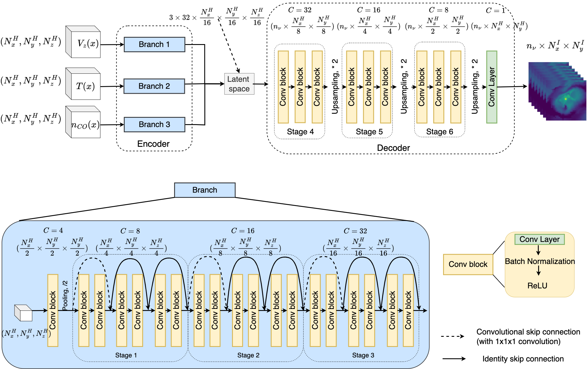
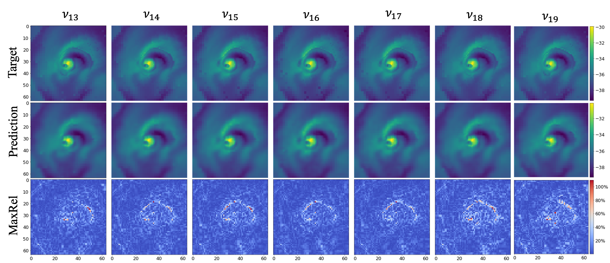

# Emulate CO Line Radiative Transfer with Deep Learning
PyTorch impelementation to build a surrogate model to emulate CO line radiation transport using an asymmetric 3D Residual Neural Network based autoencoder (-3DResAE), specifically trained to create synthetic observations of the atmospheres of evolved stars. This is accomplished by a data-driven approach, providing physics quantities - Velocity along z-axis, Temperature and number of density as input, synthetic observations are constructed from arbitory observation direction and multiple frequencies.

<p align="center">
    
</p>
<p align="center">
    
</p>

### Setup
Clone our repository
```
git clone https://github.com/beaversliv/COEmuNet.git
cd COEmuNet
```
and run the following command to install dependencies:
```bash
pip install -r requirements.txt
```

## Datset
The hydrodynamical models were provided by Jan Bolte and were generated using the [Adaptive Mesh Refinement Versatile Advection Code](https://amrvac.org/). The dataset was generated from [Pomme](https://github.com/Magritte-code/pomme) utilizing its forward line formation for simplicity. The data underlying this repo will be shared on reasonable request
to the corresponding author.

### Data Generation
We have three types of data: faceon dataset ($n_{\nu}=1,\hat{n}=(0,0,1)$), rotation dataset ($n_{\nu}=1,\hat{n}=(x,y,z)$) and multiple frequencies datset ($n_{\nu}=7,\hat{n}=(x,y,z)$).
- Generate faceon dataset
    ```
    python /physical_informed/data/data_gen/data_gen.py \
        --type original \
        -- model_grid 64 --num_rotations 100
    ```
- Generate rotation dataset
    ```
    python /physical_informed/data/data_gen/data_gen.py \
        --type rotation \
        -- model_grid 64 --num_rotations 100
    ```
- Generate multiple frequencies dataset
    ```
    python /physical_informed/data/data_gen/data_gen.py \
        --type rotation \
        -- model_grid 64 --num_rotations 100 --mulfreq
    ```
## Train a 3DResNet based autoencoder
The configurations for different datasets are written as `/config/faceon_dataset.yaml`, `/config/rotation_dataset.yaml` and `/config/mulfreq_dataset.yaml`.
- Take faceon case for example:
    ```
    python main.py --config /config/faceon_dataset.yaml
    ```
-  Enable Multi-GPU training:
    ```
    python main.py --config /config/faceon_dataset.yaml --ddp_on True
    ```
- Overwrite arguments
    ```
    python main.py --config /config/faceon_dataset.yaml \
        --batch_size 128 --seed 1234 --lr 0.004 \
        --epochs 500 --alpha 0.8 --beta 0.2 \
        --save_path <custom directory>
    ```
## Pretrained Models
Download the pre-trained COEmuNet surrogates
```bash
bash download_checkpoints.sh
```